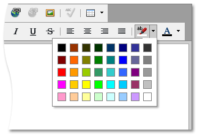

# Change Background Color in HTML Editor
To apply a specific background color to the text, do the following.
1. Select the portion of the text you are going to process.
2. Click the  button and select the color from the invoked color selector.

> [!NOTE]
> To type text with the specified background color, select the color by using the  button. To stop formatting, select the another color.