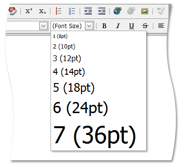

# Change Font Size
To change the text font size, do the following.
1. Select the required part of the text you want to process.
2. Click the **Font Size** list box's dropdown button and select the appropriate font size within the invoked list.

To type text with the specified font size, set it by using the **Font Size** list box. To stop formatting, set the another font size.