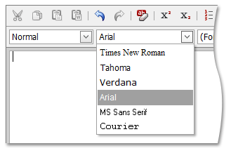

# Change Font Type
To change the text's font type, do the following.
1. Select the part of the text you want to process.
2. Click the **Font** list box' dropdown button and select the appropriated font within the opened list.

To type text with specified font, set it by using the **Font** list box. To stop formatting, define another font.