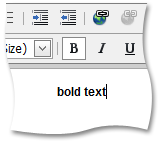

# Make Text Bold
To apply bold formatting to a specific portion of the text, do the following:
1. Select the text that you want to make bold.
2. Click the **Bold**  button or press Ctrl+B.

To remove bold formatting from the text, select the required bold-formatted part of the text, and click the button again.

To type bold formatted text, click the **Bold**  button. To stop bold formatting, click the button again.