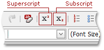

# Make Text Superscript or Subscript
To apply superscript or subscript style to text, select the required characters and click the **Superscript** or **Subscript** button.

To clear this text formatting, select the required portion of the text and click the corresponding formatting button again.

To type superscript or subscript text, press the corresponding button. To stop formatting, press the button again.