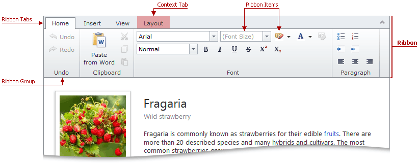

# Ribbon
The **Ribbon** is a set of items which perform common tasks in HTML content editing and formatting, grouped by functionality. Most ribbon items work in the same manner as in Microsoft Word.

HTML Editor provides the following ribbon tabs that contain predefined sets of ribbon items, grouped by functionality.
* **Home** tab contains items that provide quick shortcuts to many frequently used operations (such as clipboard operations, undo/redo operations, changing the text's font and style, etc.)
* **Insert** tab contains items that provide access to the link dialogs, image dialogs, and insert table button.
* **View** tab contains an item allowing you to switch the editor to full-screen mode.
* **Layout** context tab contains table-related items and is displayed when a selection is in a table.

> [!NOTE]
> Some buttons and functionality may be unavailable in your application. This is the choice of the application vendor.