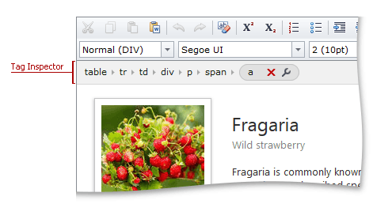
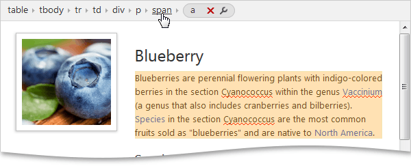
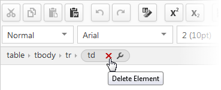
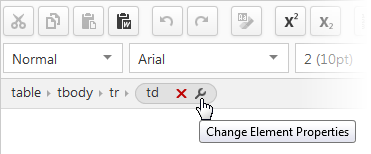

# Tag Inspector
The **Tag Inspector** allows you to navigate through a tag hierarchy, remove tags, and customize tag properties using the **Tag Properties Editor**.

Hover a tag in the **Tag Inspector** to highlight the corresponding tag in the editor content.

Click a tag in the **Tag Inspector** to select the corresponding tag in the editor content.

Click the **Delete Element** button to delete the current element in the editor's content.

Click the **Change Element Properties** button to invoke a dialog that will allow you to change the properties of the current element.

