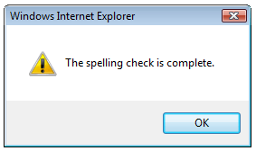

# Check Spelling
Click the **Check spelling** ( ) button to check the editor text content spelling. If the text contains spelling errors, the following dialog box allows you to preview, correct or ignore them.

After the entire text has been scanned, the following window is shown.

