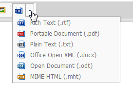
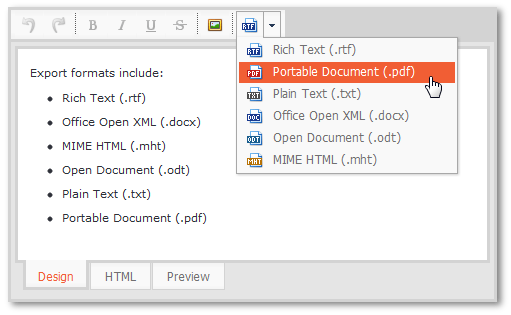

# Export Content to Various Documents Formats
To export a document, invoke a dropdown menu with the list of available document formats.

Choose the required format for export from the list. The available formats are:
* Rich Text (.rtf)
* Office Open XML (.docx)
* MIME HTML (.mht)
* Open Document (.odt)
* Plain Text (.txt)
* Portable Document (.pdf).

Click **Save** on the invoked web browser's **File Download** dialog.

Define a path for the exported document in the invoked **Save As** dialog, and click **Save**.