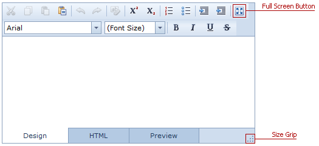

# Sizing and Full-Screen Mode
* To resize an HTML Editor place the mouse pointer over the size grip, press the left mouse button and drag the editor's scope to the required size.
* To switch to full-screen mode, click the **Full Screen Mode**   button or press F11 while the HTML Editor has focus. Note that this mode is in effect for the Design View only.

