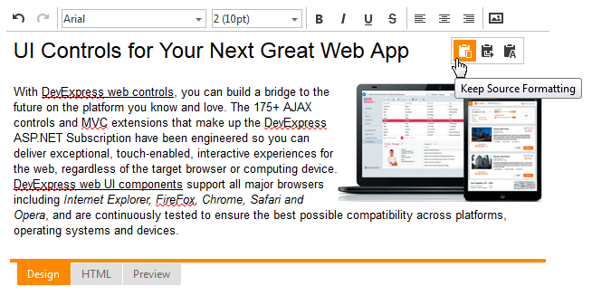

# Paste Formatting
To change the format of the pasted HTML content, click the buttons that appear at the top right corner of the editor once content is pasted.
* **Keep Source Formatting** button retains the format of the pasted content.
* **Merge Formatting** button discards format of the pasted content. However, emphasis formatting, such as bold and italic text, is retained.
* **Keep Plain Text** button discards format of the pasted content and non-text elements (such as pictures or tables).
