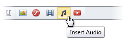
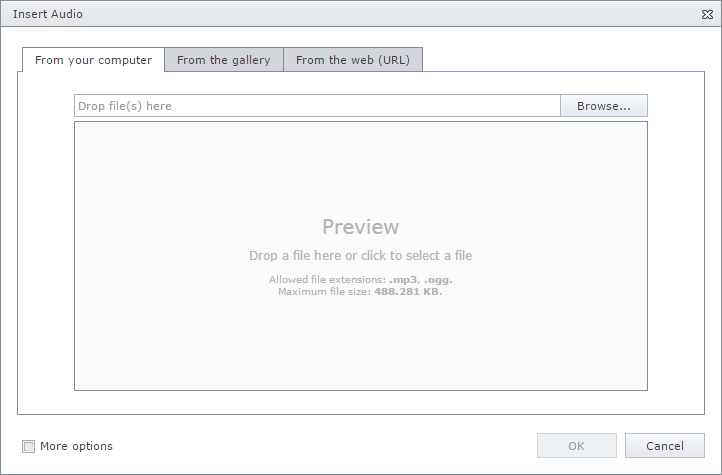
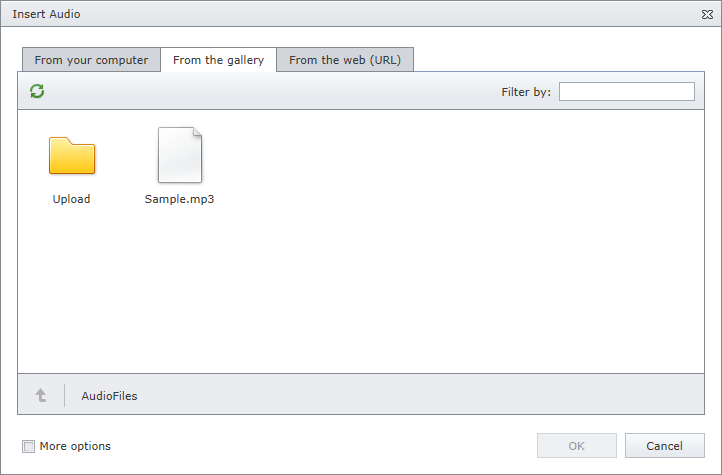
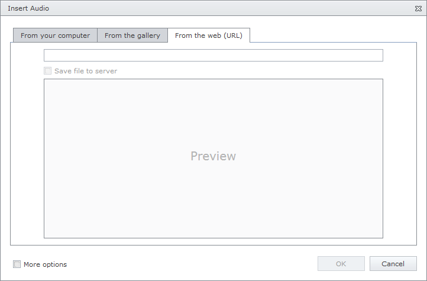

# Insert an Audio
To insert audio into an editor's content, position the mouse pointer on the place in the text where you want to add audio, and click the **Insert Audio** button.

Define the required parameters of the audio in the invoked **Insert Audio** dialog.

## Insert an Audio Stored on the Local Machine
* Click the **From your computer** tab in the **Insert Audio** dialog.
	
	
* Click the **Browse...** button, or edit box, or preview area to invoke **File Upload** dialog. Select the audio file that you want to add and click the **Open** button to upload the audio file to the web server.
* Or you can drag and drop a file to the edit box or preview area to upload the file to the web server.
* Check **More Options** to customize the [audio settings](audio-settings.md) (optional).
	
	After completing all the steps above, you can preview the audio in the **Insert Audio** dialog. The audio player allows you to listen to the audio before inserting it.
* Click the **OK** button to close the dialog and insert the audio into the editor's content.

## Insert an Audio from the Predefined Gallery
* Click the **From the gallery** tab in the **Insert Audio** dialog.
	
	
* Select the audio file that you want to add and click the **OK** button to close the dialog and insert the audio into the editor's content.

## Insert Audio by Specifying Its URL
* Click the **From the web (URL)** tab in the **Insert Audio** dialog.
	
	
* Type the web address of the audio file in the edit box.
* Check **Save file to server** if you want to upload the audio file to the web server.
* Check **More options** to customize the [audio settings](audio-settings.md) (optional).
	
	After completing all the steps above, you can preview the audio in the **Insert Audio** dialog. The audio player allows you to listen to the audio before inserting it.
* Click the **OK** button to close the dialog and insert the audio into the editor's content.

You can [modify audio](modify-audio-settings-in-html-editor.md) after inserting it into the HTML editor.