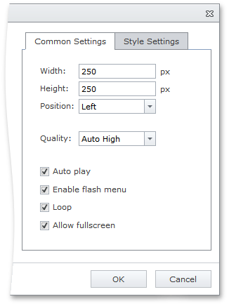

# Flash Settings
When you [insert](insert-a-flash-into-html-editor.md) or [modify](modify-flash-settings-in-html-editor.md) flash in an HTML Editor, you can customize the flash player settings.

To display the settings section in a flash dialog, select the **More options** check box.

The displayed section contains the following settings, which you can use to customize the flash player.

## Common Settings Tab

* **Width** - specifies the width of the flash player in pixels.
* **Height** - specifies the height of the flash player in pixels.
* **Position** - specifies the position of the flash player.
* **Quality** - specifies the flash rendering quality.
	* _Best_ - specifies that a flash will be rendered in the 'best' quality.
	* _High_ - specifies that a flash will be rendered in 'high' quality.
	* _Auto High_ - specifies that a flash will be rendered in the 'autohigh' quality.
	* _Medium_ - specifies that a flash will be rendered in 'medium' quality.
	* _Low_ - specifies that a flash will be rendered in 'low' quality.
	* _Auto Low_ - specifies that a flash will be rendered in the 'autolow' quality.
* **Auto Play** - specifies whether or not the flash will automatically start playing.
* **Enable flash menu** - specifies whether or not the movie playback controls are available in the flash player context menu.
* **Loop** - specifies whether or not the flash will start over again every time it is finished.
* **Allow fullscreen** - specifies whether or not the flash file can be displayed in full screen mode.

## Style Settings Tab

* **Margin top** - specifies the flash player top margin in pixels.
* **Margin bottom** - specifies the flash player bottom margin in pixels.
* **Margin left** - specifies the flash player left margin in pixels.
* **Margin right** - specifies the flash player right margin in pixels.
* **Border width** - specifies the width of the flash player border in pixels.
* **Border color** - specifies the color of the flash player border.
* **Border style** - specifies the style of the flash player border.
* **CSS class** -  specifies the CSS class applied to the flash player.