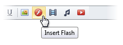
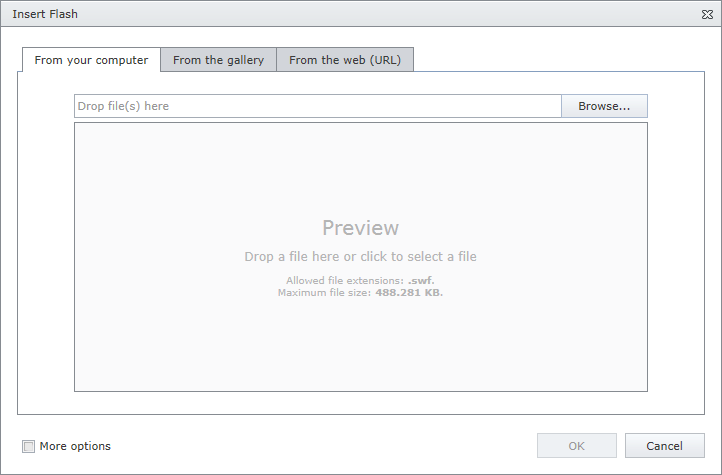
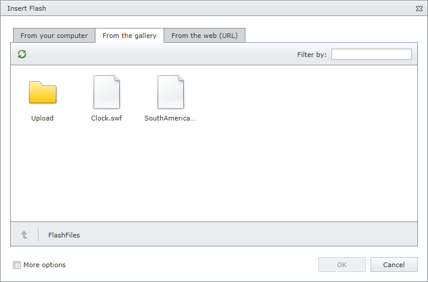
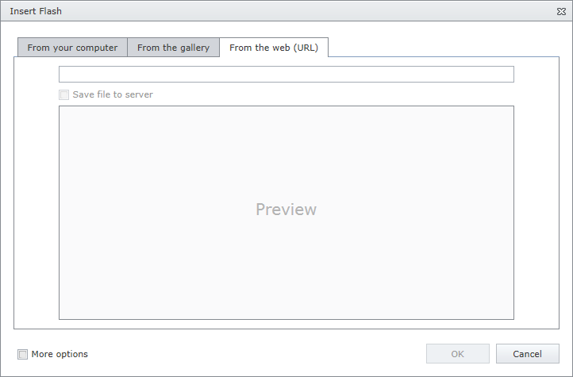

# Insert a Flash
To insert a flash into an editor's content, position the mouse pointer on the place in the text where you want to add a flash and click the **Insert Flash** button.

Define the required parameters of the flash within the invoked **Insert Flash** dialog.

## Insert a Flash Stored on the Local Machine
* Click the **From your computer** tab within the **Insert Flash** dialog.
	
	
* Click the **Browse...** button, or edit box, or preview area to invoke **File Upload** dialog. Select the flash file that you want to add and click the **Open** button to upload the flash file to the web server.
* Or you can drag and drop a file to the edit box or preview area to upload the file to the web server.
* Check **More Options** to customize the [flash settings](flash-settings.md) (optional).
	
	After completing all the steps above, you can preview the flash in the **Insert Flash** dialog.
* Click the **OK** button to close the dialog and insert the flash into the editor's content.

## Insert a Flash from the Predefined Gallery
* Click the **From the gallery** tab in the **Insert Flash** dialog.
	
	
* Select the flash file that you want to add and click the **OK** button to close the dialog and insert the flash into the editor's content.

## Insert a Flash by Specifying Its URL
* Click the **From the web (URL)** tab in the **Insert Flash** dialog.
	
	
* Type the web address of the flash file in the edit box.
* Check **Save file to server** if you want to upload the flash file to the web server.
* Check **More options** to customize the [flash settings](flash-settings.md) (optional).
	
	After completing all the steps above, you can preview the flash in the **Insert Flash** dialog.
* Click the **OK** button to close the dialog and insert the flash into the editor's content.

You can [modify the flash](modify-flash-settings-in-html-editor.md) after inserting it into HTML editor.