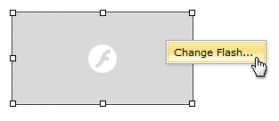
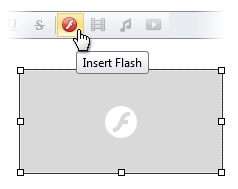

# Modify Flash Settings
To modify flash element settings within editor content, do one of the following.
* Double-click the flash element.
* Right-click the flash element and select **Change Flash...** within the invoked context menu.
	
	
* Select the flash element and click the **Insert Flash** button.
	
	

The opened **Change Flash** dialog allows you to modify flash element settings. More detailed information is available in the [Insert a Flash Into HTML Editor](insert-a-flash-into-html-editor.md) section.