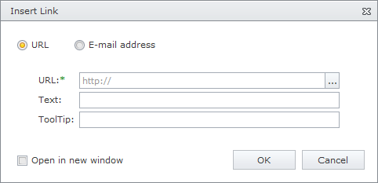
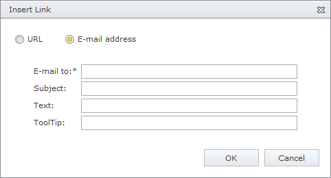

# Create a Hyperlink
## Add a Hyperlink
* Select the text or image that you want to display as a hyperlink and click the **Insert Link** button.
* Or, simply click the **Insert Link** button to create a new text link at the current cursor position.

## Specify Hyperlink Settings
After you've pressed the **Insert Link** button, the **Insert Link** dialog is invoked. The radio button at the top allows you to choose whether you want to enter a URL or an e-mail address.

### Enter a URL

Type a target URL within the edit box or call a built-in [document selector](../../file-manager.md) by clicking the **Browse** button.

The hyperlink's settings can be customized by using the following parameters:

| Parameter | Description |
|---|---|
| URL | Specifies the target URL. |
| Text | Specifies the link text.  This parameter is not available when creating image links. |
| Tooltip | Specifies the text that will appear in the tooltip when the mouse cursor is placed over the hyperlink. |
| Open in new window | Specifies whether to open the URL in the same window, or new one. |

**Enter an E-mail Address**

The e-mail's settings can be customized using the following parameters:

| Parameter | Description |
|---|---|
| Email to | Defines an email address. |
| Subject | Specifies the subject of the email message. |
| Text | Specifies the link text. This parameter is not available when creating image links. |
| Tooltip | Specifies the text that will appear in the tooltip when the mouse cursor is placed over the hyperlink. |

Click the **OK** or **Cancel** button to save or reject the changes made.