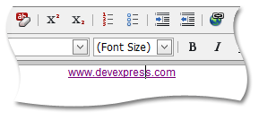

# Modify a Hyperlink
To modify a hyperlink, do the following.
1. Select a hyperlink; or place a mouse pointer inside a link if you are going to modify a text hyperlink; or select an image in order to edit an image hyperlink.
	
	
2. Click the **Insert link** button. Alternatively, you can right-click and select the **Change Link** item within the invoked context menu.
	
	
3. Modify the hyperlink's settings within the invoked **Change Link** dialog, according to the type of a hyperlink - text or image hyperlink. Detailed information about the hyperlink's available settings can be obtained from the [Create a Hyperlink](create-a-hyperlink-in-html-editor.md) section.
4. Click **OK** to save the modified hyperlink.