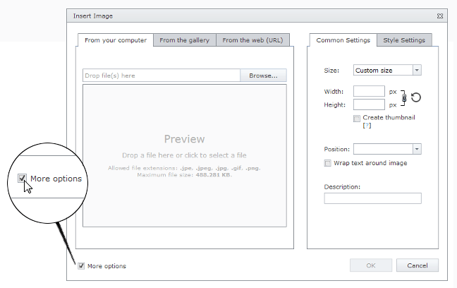
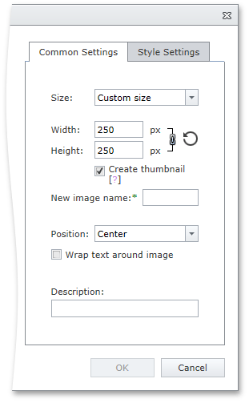

# Image Settings
When you [insert](insert-an-image-in-html-editor.md) or [modify](modify-an-images-settings-in-html-editor.md) image in an HTML Editor, you can customize the image settings.

To display the settings section in an image dialog, select the **More options** check box.

The displayed section contains the following settings, which you can use to customize the image.

## Common Settings Tab

* **Size** - specifies if the image is a custom or original size.
* **Width** - specifies the width of the image in pixels (for custom size).
* **Height** - specifies the height of the image in pixels (for custom size).
* **Create thumbnail** - specifies if a thumbnail will be created from the image with the specified size (for custom size).
* **New image name** - specifies a name for the image thumbnail.
* **Position** - specifies the position of the image.
* **Wrap text around image** - specifies whether text should be wrapped around the image.
* **Description** - specifies the image description.

## Style Settings Tab

* **Margin top** - specifies the image top margin in pixels.
* **Margin bottom** - specifies the image bottom margin in pixels.
* **Margin left** - specifies the image left margin in pixels.
* **Margin right** - specifies the image right margin in pixels.
* **Border width** - specifies the width of the image border in pixels.
* **Border color** - specifies the color of the image border.
* **Border style** - specifies the style of the image border.
* **CSS class** -  specifies the CSS class applied to the image.