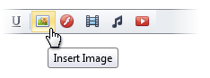
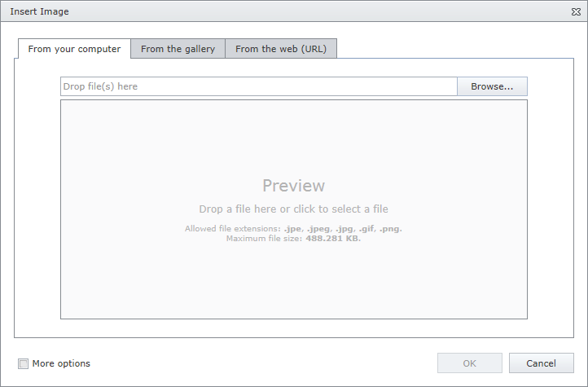
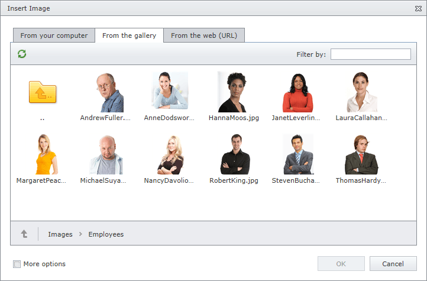
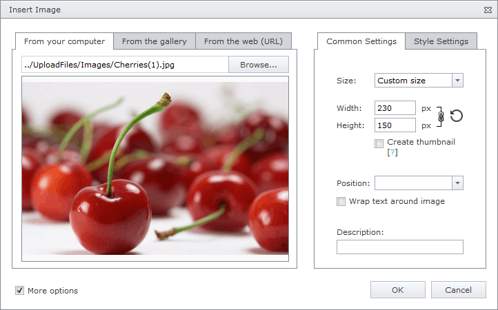

# Insert an Image
To insert an image into an editor's content, position the mouse pointer on the place in the text where you want to add an image and click the **Insert Image** button.

Define the required parameters of the image within the invoked **Insert Image** dialog.

## Insert an Image Stored on the Local Machine
* Select the **From this computer** radio button within the **Insert Image** dialog.
	
	
* Click the **Browse...** button, or edit box, or preview area to invoke **File Upload** dialog. Select the image file that you want to add and click the **Open** button to upload the image file to the web server.
* Or you can drag and drop a file to the edit box or preview area to upload the file to the web server.
* Check **More Options** to customize the [image settings](image-settings.md) (optional).
	
	After completing all the steps above, you can preview the image in the **Insert Image** dialog.
* Click the **OK** button to close the dialog and insert the image into the editor's content.

## Insert an Image from the Predefined Gallery
* Click the **From the gallery** tab in the **Insert Image** dialog.
	
	
* Select the image that you want to add and click the **OK** button to close the dialog and insert the image into the editor's content.

## Insert an Image by Specifying Its URL
* Click the **From the web (URL)** tab in the **Insert Image** dialog.
	
	
* Type the web address of the image file in the edit box.
* Check **Save file to this server** if you want to upload the image to the web server.
* Check **More options** to customize the [image settings](image-settings.md) (optional).
	
	After completing all the steps above, you can preview the image in the **Insert Image** dialog.
* Click the **OK** button to close the dialog and insert the image into the editor's content.

You can [modify the image](modify-an-images-settings-in-html-editor.md) after inserting it into the HTML editor.