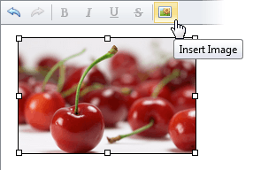

# Modify an Image's Settings in HTML Editor
To modify an image's settings within the editor's content, do one of the following.
* Double-click the image.
* Right-click on the image and select **Change Image** within the invoked context menu.
	
	
* Select the image and click the **Insert Image** button.
	
	

The opened **Change Image** dialog allows you to modify the image's settings. More detailed information about modifying image settings is available in the [Insert an Image in HTML Editor](../../../../interface-elements-for-web/articles/html-editor/working-with-images/insert-an-image-in-html-editor.md) section.