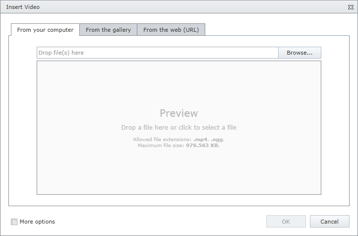
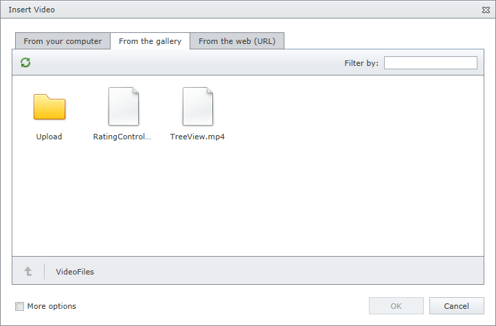
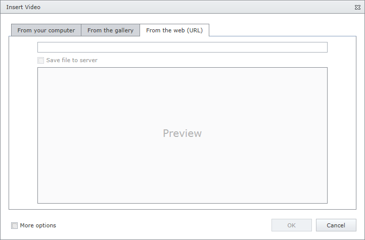

# Insert a Video Into
To insert video into an editor's content, position the mouse pointer on the place in the text where you want to add video and click the **Insert Video** button.

Define the required parameters of the video within the invoked **Insert Video** dialog.

## Insert an Video Stored on the Local Machine
* Click the **From your computer** tab in the **Insert Video** dialog.
	
	
* Click the **Browse...** button, or edit box, or preview area to invoke **File Upload** dialog. Select the video file that you want to add and click the **Open** button to upload the video file to the web server.
* Or you can drag and drop a file to the edit box or preview area to upload the file to the web server.
* Check **More Options** to customize the [video settings](video-settings.md) (optional).
	
	After completing all the steps above, you can preview the video in the **Insert Video** dialog.
* Click the **OK** button to close the dialog and insert the video into the editor's content.

## Insert an Video from the Predefined Gallery
* Click the **From the gallery** tab in the **Insert Video** dialog.
	
	
* Select the video file that you want to add and click the **OK** button to close the dialog and insert the video into the editor's content.

## Insert an Video by Specifying Its URL
* Click the **From the web (URL)** tab in the **Insert Audio** dialog.
	
	
* Type the web address of the video file in the edit box.
* Check **Save file to server** if you want to upload the video file to the web server.
* Check **More options** to customize the [video settings](video-settings.md) (optional).
	
	After completing all the steps above, you can preview the video in the **Insert Audio** dialog. The vodeo player allows you to view the video before inserting it.
* Click the **OK** button to close the dialog and insert the video into the editor's content.

You can [modify video](modify-video-settings-in-html-editor.md) after inserting it into an HTML editor.