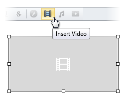

# Modify Video Settings
To modify video element settings within editor content, do one of the following.
* Double-click the video element.
* Right-click the video element and select **Change Video...** within the invoked context menu.
	
	
* Select the video element and click the **Insert Video** button.
	
	

The opened **Change Video** dialog allows you to modify video element settings. More detailed information is available in the [Insert a Video Into HTML Editor](insert-a-video-into-html-editor.md) section.