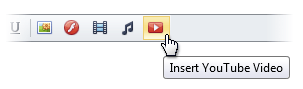
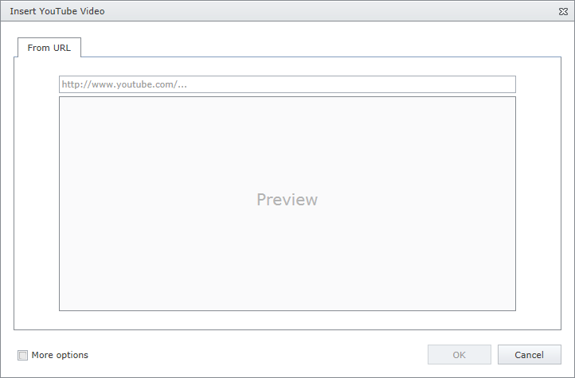

# Insert a YouTube Video
To insert a YouTube video into an editor's content, position the mouse pointer on the place in the text where you want to add a YouTube video and click the **Insert YouTube Video** button.

Define the required parameters of the YouTube video in the invoked **Insert YouTube Video** dialog.

* Type the web address of the YouTube video in the edit box. Note that the URL should be as follows: http://www.youtube.com/watch?v=videoID
* Check **More options** to customize the [YouTube video settings](youtube-video-settings.md) (optional).

After completing the steps above, you can preview the YouTube video in the **Insert YouTube Video** dialog.

Click the **OK** button to close the dialog and insert the YouTube video into the editor's content.

You can [modify the YouTube video](modify-youtube-video-settings-in-html-editor.md) after inserting it into an HTML editor.