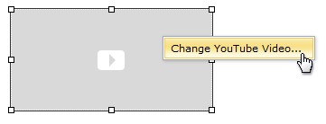
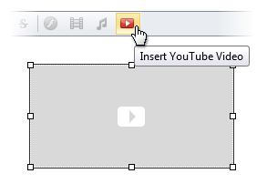

# Modify YouTube Video Settings
To modify YouTube video element settings within editor content, do one of the following.
* Double-click the YouTube video element.
* Right-click the YouTube video element and select **Change YouTube Video...** within the invoked context menu.
	
	
* Select the YouTube video element and click the **Insert YouTube Video** button.
	
	

The opened **Change YouTube Video** dialog allows you to modify YouTube video element settings. More detailed information is available in the [Insert a YouTube Video Into HTML Editor](insert-a-youtube-video-into-html-editor.md) section.