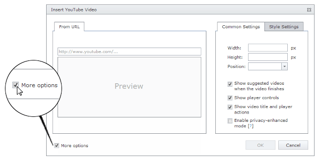
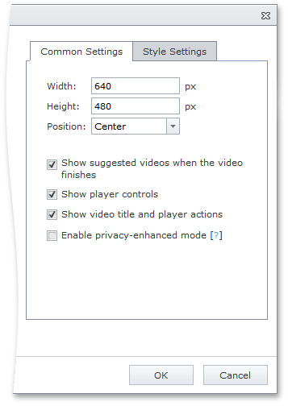

# YouTube Video Settings
When you [insert](insert-a-youtube-video-into-html-editor.md) or [modify](modify-youtube-video-settings-in-html-editor.md) YouTube video in an HTML Editor, you can customize the video player settings.

To display the settings section in a YouTube video dialog, select the **More options** check box.

The displayed section contains the following settings, which you can use to customize the YouTube video player.

## Common Settings Tab

* **Width** - specifies the width of the YouTube video player in pixels.
* **Height** - specifies the height of the YouTube video player in pixels.
* **Position** - specifies the position of the YouTube video player.
* **Show suggested videos when the video finishes** - specifies whether or not the suggested videos will be displayed when the video finishes.
* **Show player controls** - specifies whether or not the YouTube video player controls should be displayed.
* **Show video title and player actions** - specifies whether or not the information about video is displayed.
* **Enable privacy-enhanced mode** - specifies whether or not YouTube stores information about visitors on your webpage unless they play the video.

## Style Settings Tab

* **Margin top** - specifies the video player top margin in pixels.
* **Margin bottom** - specifies the video player bottom margin in pixels.
* **Margin left** - specifies the video player left margin in pixels.
* **Margin right** - specifies the video player right margin in pixels.
* **Border width** - specifies the width of the video player border in pixels.
* **Border color** - specifies the color of the video player border.
* **Border style** - specifies the style of the video player border.
* **CSS class** -  specifies the CSS class applied to the video player.