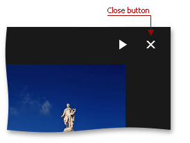
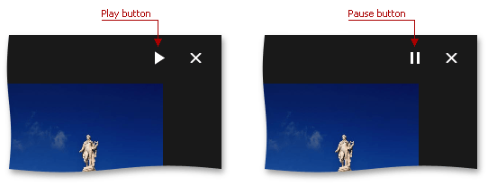

# Fullscreen Viewer
The image gallery **Fullscreen Viewer** displays images in full screen mode and allows you to navigate through them.

Hover the navigation bar marker () to display a navigation bar.

You can navigate through images by clicking the navigation buttons or the image area, or by pressing the arrow keys. You can also use the mouse scroll wheel, or perform a swipe gesture. You can also use the swipe gesture on touch devices.

## Closing the Fullscreen Viewer
To close the fullscreen viewer, click the **Close** button or press the ESC key.

## Slide Show
The fullscreen viewer can display images in a slide show. To play the slide show, click the **Play** button. To pause the slide show, click the **Pause** button. Note that you can still navigate through images manually, while the slide show is playing.

