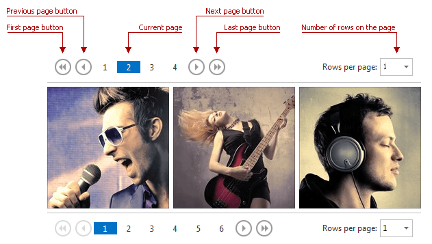

# Image Gallery Pager
The image gallery pager allows you to navigate through image data pages. It can be displayed at the top, bottom, or top and bottom of the Image Gallery. To navigate to a specific page, click its number in the pager. Additionally, you can use the pager buttons to navigate to the next, previous, first or last page. The current page is highlighted.

The **Rows per page** menu allows you to select the number of rows to be displayed on the page.

If the **Show more items...** link is displayed, click it to load more images to the image gallery.

