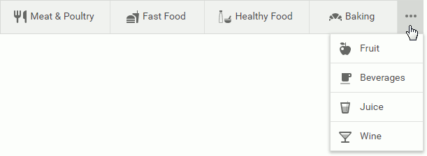

# Responsive Layout

The menu can display its items as follows when they do not fit the browser window's width:

* Move items to a drop-down menu. To show these items, hover the ellipsis button.

* Display icons only. When you hover an item, its caption is displayed as a tooltip.

* Orientate vertically and hide items under the hamburger button. You can click this button to show vertical side-menu.

