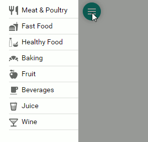

# Adaptive Layout

When the browser window changes its width, the menu can operate in the following modes:
* The menu automatically resizes or hides its items to the popup menu hidden under the ellipse button. Click the ellipsis button to show the hidden items.

* The horizontal menu items are automatically transformed into the vertical side-menu that is invoked by clicking a hamburger button.

