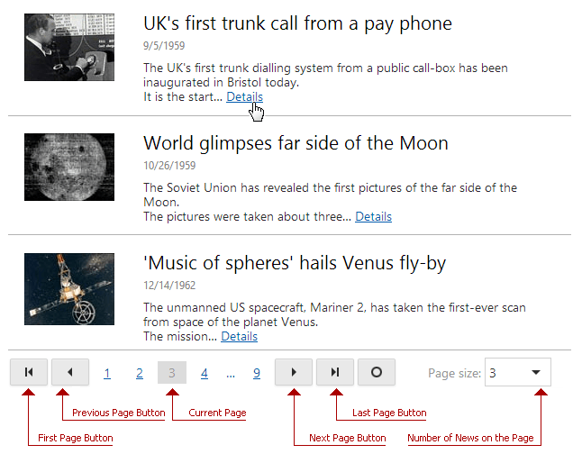

# News Control
The News Control displays news in a list-based view. Click **Details** to open a page with a required article.

## News Control Pager
The news control pager allows you to navigate through news pages. To navigate to a specific page, click its number in the pager. Additionally, you can use the pager buttons to navigate to the next, previous, first or last page. The current page is highlighted.

The **Page size** menu allows you to select the number of news articles on the page.