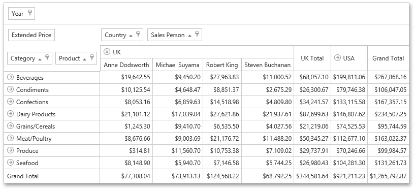

# Pivot Table
The **Pivot Table** is a data bound control that provides maximum capabilities for organizing, summarizing and analyzing your business data.

&nbsp;

**Data Presentation**
* [Sort Data in Pivot Tables](pivot-table/data-presentation/sort-data-in-pivot-tables.md)
	
	Describes how you can sort field values alphabetically or by summary values displayed in a particular column or row.
* [Filter Data in Pivot Tables](pivot-table/data-presentation/filter-data-in-pivot-tables.md)
	
	Provides information on how to filter data by hiding specific rows or columns via filter drop-down lists, and how to provide a more advanced filtering by building a complex filter condition.

&nbsp;

**Layout Customization**
* [Expand and Collapse Groups in Pivot Tables](pivot-table/layout-customization/expand-and-collapse-groups-in-pivot-tables.md)
	
	Provides information on how to expand and collapse field values and field headers.
* [Hide Pivot Table Fields](pivot-table/layout-customization/hide-pivot-table-fields.md)
	
	Guides you through the process of hiding Pivot Table fields.
* [Display Hidden Pivot Table Fields](pivot-table/layout-customization/display-hidden-pivot-table-fields.md)
	
	Describes how to display fields that have previously been hidden.
* [Reorder Pivot Table Fields](pivot-table/layout-customization/reorder-pivot-table-fields.md)
	
	Provides information on how to reorder Pivot Table fields.

&nbsp;

**Field List**
* [Field List Overview](pivot-table/field-list-overview.md)
	
	Provides basic information about Field Lists.
* [Invoke a Field List](pivot-table/field-list/invoke-a-field-list.md)
	
	Describes how to invoke a Field List.
* [Defer Pivot Table Updates](pivot-table/field-list/defer-pivot-table-updates.md)
	
	Describes how to prevent automatic Pivot Table updates and force it to update manually.
* [Change Field List Layout](pivot-table/field-list/change-field-list-layout.md)
	
	Provides information on how to change the layout of an advanced Field List.