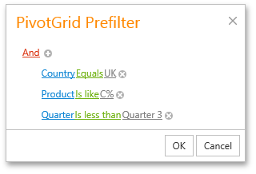
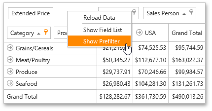
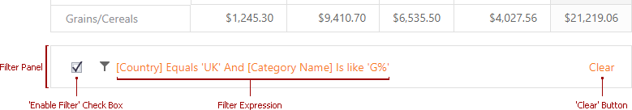

# Build Complex Filter Criteria
Use a **Filter Editor** to build complex filter criteria with an unlimited number of filter conditions, combined by logical operators.

## Filter Editor

To invoke the Filter Editor, click an empty space within the Pivot Table header region and select **Show Filter** from the context menu.

The Pivot Table synchronizes filters applied in [Filter Windows](filter-data-by-field-values/using-filter-popup-windows.md) and the Filter Editor. You can customize the filter sting or clear it to reset applied filters.

If you use **classic** mode, a **Prefilter** is available instead.

Note that the Prefilter does not affect filters applied in Filter Windows.

To invoke the Prefilter, click an empty space within the Pivot Table header region and select **Show Prefilter** from the context menu.

## Filter Panel

After you have built and applied a filter condition, a **Filter Panel** appears at the bottom of the Pivot Table. This panel displays the filter condition.

The Filter Panel displays a filter expression, a check box used to temporarily enable/disable the filter, and a 'clear' button used to reset the current filter condition.

To modify a filter condition, open the Filter Editor. In the filter panel, click a filter condition to invoke it.

For information on the Filter Editor filtering capabilities, see [Filter Editor](../../../filter-editor.md).
