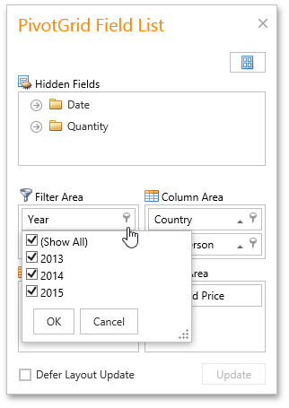

# Invoke a Filter Popup Window
You can invoke a Filter Window from the Pivot Table or from a Field List (to learn about Field Lists, see [Field List Overview](../../../field-list-overview.md)).

## Invoke a Filter Window from the Pivot Table
Field headers display special buttons used to invoke a Filter Window.

Click a header's filter button. This invokes the filter dropdown, which lists unique field values.

## Invoke a Filter Window from a Field List
You can use an advanced Field List to filter field values.

First, invoke a Field List. For information on how to do this, see [Invoke a Field List](../../../field-list/invoke-a-field-list.md).

To open a Filter Window, click the filter button displayed in the field header.

