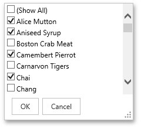
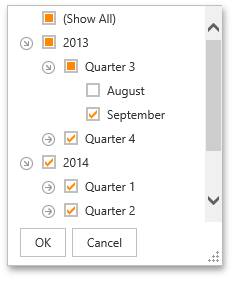
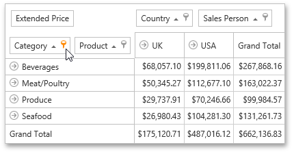

# Using Filter Popup Windows
Depending on the settings made by your application vendor, the Pivot Table can display an individual Filter Window for each field, or an integrated Filter Window for a group of fields.

This topic describes how to filter data using both types of Filter Windows.

## Simple Filter Window
A simple Filter Window allows you to hide visible and show previously hidden values of a particular field.

In the Filter Window, uncheck field values that should be hidden and check values that should be visible. Then, click **OK** to close the window and apply the filtering.

## Hierarchical Filter Window
A hierarchical Filter Window displays values of several fields, arranged in a tree-like manner.

In the Filter Window, uncheck field values that should be hidden and check values that should be visible.

Use the  buttons to expand field values and access their child values. To collapse an expanded field value and hide its child values, use the  button.

Click **OK** to close the window and apply the filtering.

## Filtering Indication
If a field's values are filtered, the corresponding filter button is highlighted.

## Removing Filtering
To remove filtering against a specific field, invoke its Filter Window and select **(Show All)**.