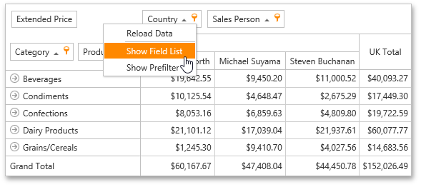

# Invoke a Field List
To invoke a Field List, right-click on an empty space within the Pivot Table header region, and select **Show Field List** from the context menu.

A simple or advanced Field List (similar to one of those shown below) will be displayed.

&nbsp;&nbsp;

To learn more about Field Lists, see [Field List Overview](../field-list-overview.md).