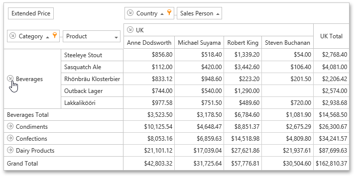
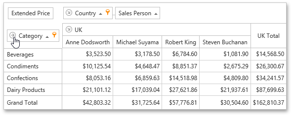

# Expand and Collapse Groups in Pivot Tables
## Expand/Collapse Values Groups
To expand/collapse value groups, do one of the following.
* Click the corresponding expand button.
	
	
* Right-click a value that has nested values, and select the required Expand or Collapse command from the menu that opens.
	
	

## Expand/Collapse Fields
To expand/collapse a group of fields, click a corresponding field expand button.

