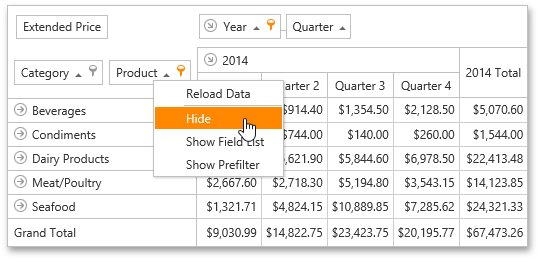

# Hide Fields Using the Context Menu
To hide a field, right-click within its header and select **Hide** within the context menu that opens.

You can also use a Field List to hide fields. To learn more, see [Hide Fields Using a Field List](../../../../../interface-elements-for-web/articles/pivot-table/layout-customization/hide-fields/hide-fields-using-a-field-list.md).