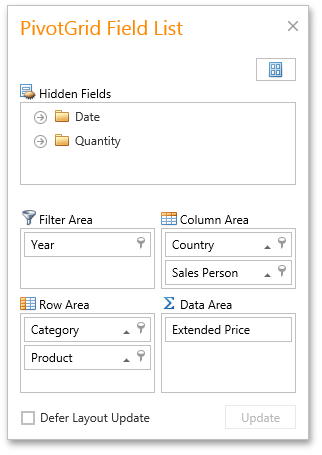
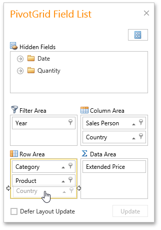

# Reorder Fields Using a Field List
You can use an advanced Field List to reorder fields (to learn more about Field Lists, see [Field List Overview](../../field-list-overview.md)).

First, invoke a Field List. For information on how to do this, see [Invoke a Field List](../../field-list/invoke-a-field-list.md).

To reorder fields, drag their headers within or between Field List sections that correspond to different Pivot Table areas.

You can also reorder fields via simple drag-and-drop operations without invoking a Field List. To learn more, see [Simple Fields Reordering](simple-fields-reordering.md).