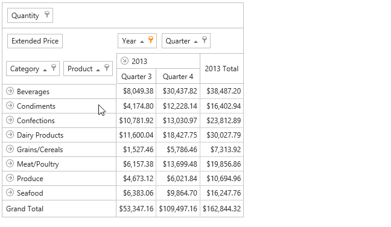

# Simple Fields Reordering
To move a field to another position, use drag-and-drop.

You can also use a Field List to reorder fields. For more information, see [Reorder Fields Using a Field List](reorder-fields-using-a-field-list.md).