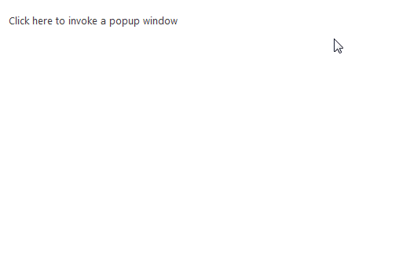
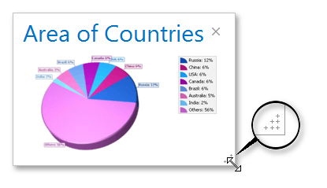
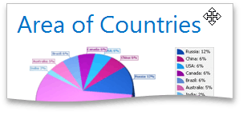

# Popup Window
The Popup Window is a temporary window that appears above an application's main window. It is typically used to display quick reference information. The popup window can be displayed when hovering or clicking a specific element, or it can initially be visible.

## Window Resizing and Dragging
If a window displays a size grip, you can use it to resize the window.

To change the window position, click and hold its header (the cursor will change to a four-directional arrow). Drag the header and drop it to the required position.

## Header Buttons

A popup window's header can display the following buttons.

| Button | Description |
|---|---|
| Pin Button | Allows you to pin the window. |
| Refresh Button | Allows you to refresh the window. |
| Collapse Button | Allows you to collapse the window. |
| Maximize Button | Allows you to maximize the window. |
| Close Button | Allows you to close the window. |

## Closing a Popup Window
Depending on the settings specified by the application vendor, a popup window can be closed in the following ways.
* By clicking the **Close** button
* By moving the cursor out of the window
* By clicking an area outside of the window
* By pressing the ESC key.