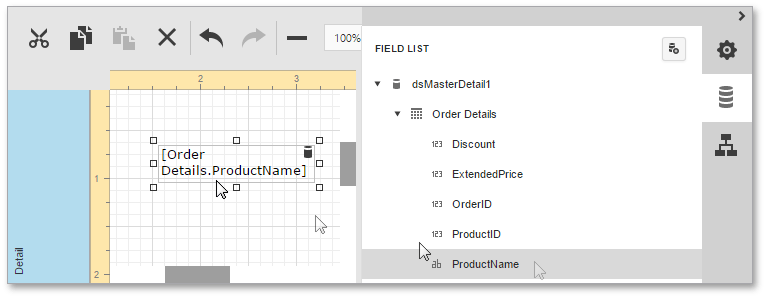
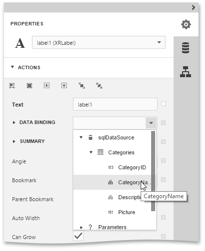
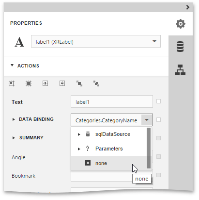
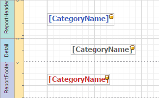

# Bind Report Controls to Data
This topic describes how [report controls](../../report-elements/report-controls.md) can be bound to data fields, and explains how controls are rendered on different [report bands](../../report-elements/report-bands.md).

This document consists of the following sections.
* [Controls Binding](#binding)
* [Controls Unbinding](#unbinding)
* [Control Behavior on Different Bands](#behavior)

## <a name="binding"/>Controls Binding
A report control can be bound to a data field available in the [report's data source](bind-a-report-to-data.md). And a control can also be bound to a calculated field or parameter. You can provide data to elements of the report in the following ways.
* **Create a Data-Aware Element**
	
	The [Web Report Designer](../../../report-designer.md) allows you to add a new bound report control using the [Field List](../../interface-elements/field-list.md).
	
	To create a data-aware element, switch to the Field List panel, click the desired field item, and then drag and drop it onto the report band. After this, a control that is bound to the selected data field will appear.
	
	
* **Bind an Element to Data**
	
	To bind an existing report element to a data member, select this element, switch to the [Properties Panel](../../interface-elements/properties-panel.md), and in the **Actions** category, specify the **Data Bindings** property.
	
	
	
	Or in the Properties Panel, expand the **Data** category, then expand the **Data Bindings** section, and choose the property you want to bind.
	
	After that, you can also specify a format for output values. For details, refer to [Formatting Data](../shaping-data/formatting-data.md).

## <a name="unbinding"/>Controls Unbinding
To unbind a control's property, switch to the Properties Panel, and set the **Data Bindings** property to **None**.

## <a name="behavior"/>Control Behavior on Different Bands
When binding a control to a data field, its rendering depends on the band type where the control resides. For example, if a control is placed in the [Detail band](../../report-elements/report-bands.md), every single record in the data source will be returned and displayed in the control. Bound controls in [grouping bands](../../report-elements/report-bands.md) show data by dividing all data into groups.

And bound controls in remaining bands display data from the record which is current when the band they are in is being printed/displayed. This is illustrated in the following images.

| Report Designer | Report Preview |
|---|---|
|  |  |