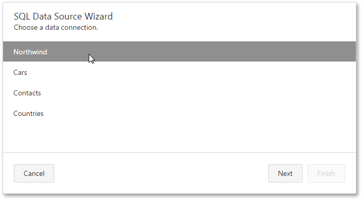

# Choose a Data Connection
On this wizard page, you are required to select a data connection that provides necessary information to connect to a database.

Select a data connection and click **Next** to proceed to the next wizard page: [Create a Query or Select a Stored Procedure](create-a-query-or-select-a-stored-procedure.md).