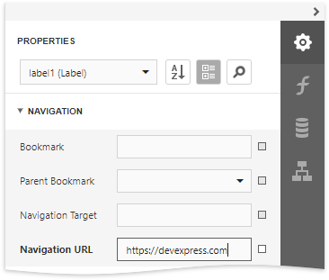
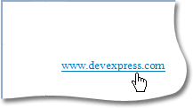

# Add Cross-References and Hyperlinks

This document describes how to make an element navigate to other elements in a report or external resources by clicking it in a Print Preview.

## Add Cross-References
You can improve report navigation using a cross-reference because the link's target is in the same document.

You can add a cross-reference for a [report control](../use-report-elements.md) by setting the following properties:

1. Set the **Navigation Target** property to *&#0095;self* to specify that the link is in the same document.

2. Set the **Navigation Url** property to the target control's **Name** property value.

    

In this case, the control behaves like a link meaning that the cursor automatically changes to a hand in a report's preview when hovering the control. You can make a control resemble a link by specifying its  [appearance properties](../customize-appearance/appearance-properties.md) (for example, change the text's color to blue and underline it).

The link uses the first occurrence if there are multiple instances of an object marked as a link's target.

> [!TIP]
> A report's cross-references are preserved when [exporting it to PDF](../preview-print-and-export-reports.md).

## Add Hyperlinks
A hyperlink means that a link's target is outside the report.

You can use any control as a link by setting the **Navigation Url** property to the required target document's URL.

> [!NOTE]
> Remember to use the "http://" or "https://" prefix when specifying the URL.

You can make a control resemble a link by specifying its  [appearance properties](../customize-appearance/appearance-properties.md) (for instance, set the underlined text and blue color).

The cursor automatically changes to a hand when hovering the control in a report's preview.

Use the link's **Navigation Target** property to specify where to open the target document (in the same preview window, in a new blank window, etc.).

> [!TIP]
> A link's behavior is preserved when [exporting a report](../preview-print-and-export-reports.md) to most of the available formats (in particular to PDF, HTML, MHT, RTF and Excel).