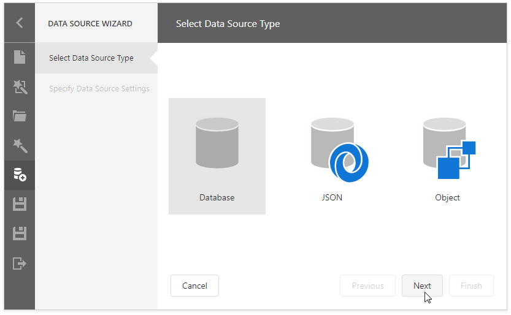
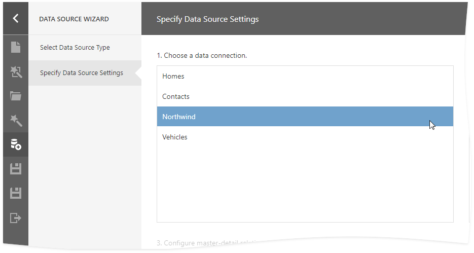
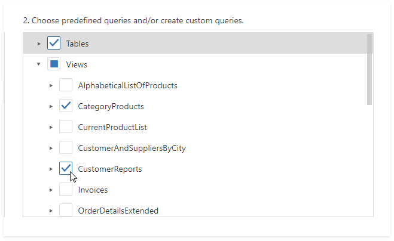
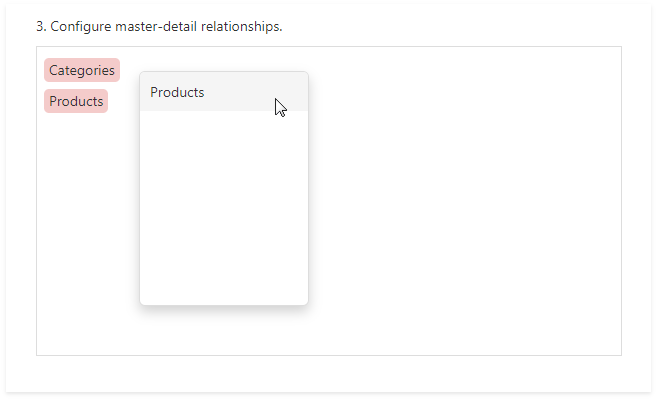
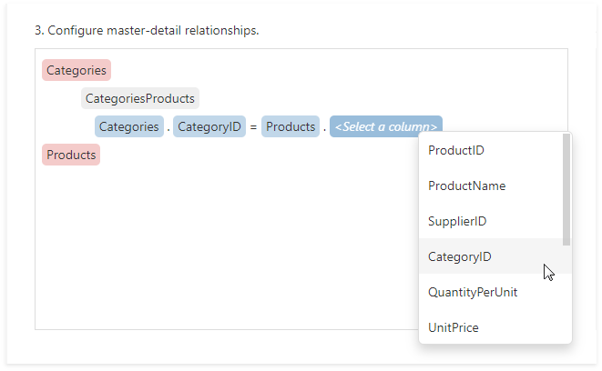
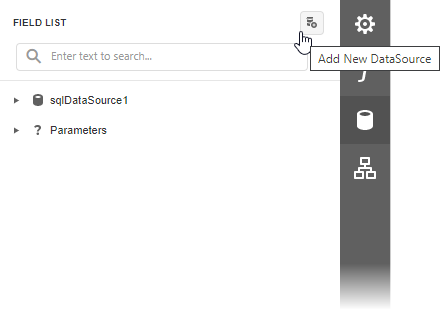
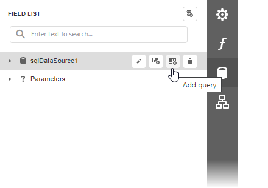

# Bind a Report to a Database

This tutorial illustrates how to bind a report to a database and specify a master-detail relationship between data source queries.

## Add a New Data Source

1. [Create a new blank report](../../report-designer/add-new-reports.md).
1. Invoke the designer [menu](../report-designer-tools/menu.md) and click **Add Data Source**.

    

   The menu contains this command if your software vendor has registered data connections in the application.

1. Select **Database** in the invoked [Data Source Wizard](../report-designer-tools/data-source-wizard.md) and click **Next**. Available database types depend on the data connections registered in the application for the Data Source Wizard.

    

1. Select the data connection and click **Next**.

    

1. Choose which tables, views and/or stored procedures to add to a report and click **Next**. Select two or more tables to [create a master-detail report](../create-reports/master-detail-reports-with-detail-report-bands.md).

    
    
    > [!NOTE]
    > You can also create [custom queries](../report-designer-tools/data-source-wizard/specify-data-source-settings-database.md) to shape data at the data source level. Select **Queries** and click the plus button to add a new query.
    > 
    > The invoked [Query Builder](../report-designer-tools/query-builder.md) allows you to join multiple tables, filter, sort, and group their data, and calculate various aggregate functions.
      

1. Set master-detail relationships on this wizard page. Hover the master table name, click the plus button and choose the detail table. 

    

    Select the required key fields (columns) to connect tables. 

    

    Click **Finish** to close the Data Source Wizard.

## Use an Existing Data Source

You can bind your report to a predefined data source. Open the [Field List](../report-designer-tools/ui-panels/field-list.md) panel, click the **Add DataSource** button and select a data source from the drop-down list.

The Field List reflects the added SQL data source and its hierarchy. You can select the data source to edit it.

