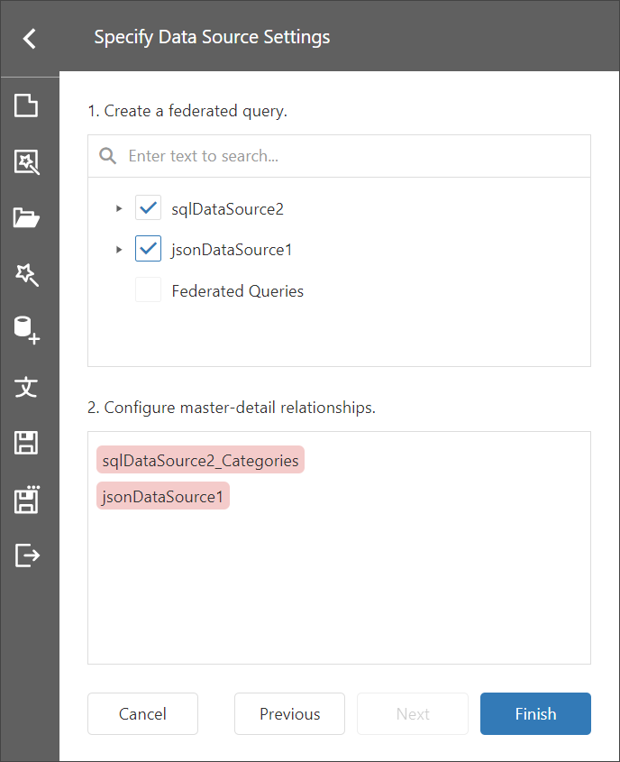
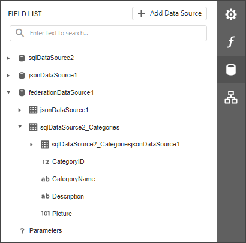

# Bind a Report to a Federated Master-Detail Data Source

This topic describes how to create a federated data source that retrieves data from multiple data sources and sets the master-detail relationship between the queries.

## Create a Report and Data Sources

1. [Create a new blank report](../../../articles/report-designer/report-designer-tools/report-wizard/empty-report.md).

2. [Add a SQL data source](../../../articles/report-designer/bind-to-data/bind-a-report-to-a-database.md) that retrieves data from the `Customers` table of the **Northwind** database.

3. [Add a JSON data source](../../../articles/report-designer/bind-to-data/bind-a-report-to-json-data.md) that retrieves product data from the **nwind.json** file. The **nwind.json** file is included in the sample web project if you create it from the Visual Studio template.

The Field List pane in the End-User Report Designer appears as follows:

## Create Data Federation

1. Invoke the designer [menu](../report-designer-tools/menu.md) and click **Add Data Source**.

    

1. Select **Data Federation** in the invoked [Data Source Wizard](../report-designer-tools/data-source-wizard.md) and click **Next**.

    

1.  On the next page, enable check boxes for the SQL data source's table and the JSON data source. The selected items are included in data federation as separate queries.

    

1. Click the **+ (plus) element** command element in the **Configure master-detail relationships** pane, and specify the master-detail relationship as shown below:

    
    
    Click **Finish** to complete the Data Source Wizard.

1. The Data Source Wizard creates a new **FederationDataSource** that includes two queries with a master-detail relationship. The [Field List](../../../articles/report-designer/report-designer-tools/ui-panels/field-list.md) reflects the data source's structure.

    

The Data Source Wizard specifies query names as follows:
* If the initial data source contains data at the root level (as the JSON data source), the federated query's name is equal to the data source name.
* If the initial data source contains one or more queries (as the SQL data source), the federated query's name consists of the data source name and query name separated by an underscore.

## Manage the Federation Data Source

You can rename the query in the **Manage Queries** dialog. To invoke the dialog, click the **Manage Queries** button.

The **Manage Queries** dialog appears.

Click the query name in the list to invoke the text editor and change the name.

The **Manage Queries** dialog allows you to add, modify, or delete queries.

To add a new query, click the **Add query** drop-down in the bottom left corner and select the
query type: Join, Union, or Transform. The Query Builder is invoked to help you construct a new query.

To edit a query, select the query name in the list and click the **Edit button** that appears in the selected item. The Query Builder window is invoked to help you edit a query.

To delete a query, select the query name in the list and click the **Delete button** that appears in the selected item. The query is deleted without confirmation.

> [!NOTE]
> Once you rename the query, update the **Data Member** properties for the DetailReport band and the Report itself.

