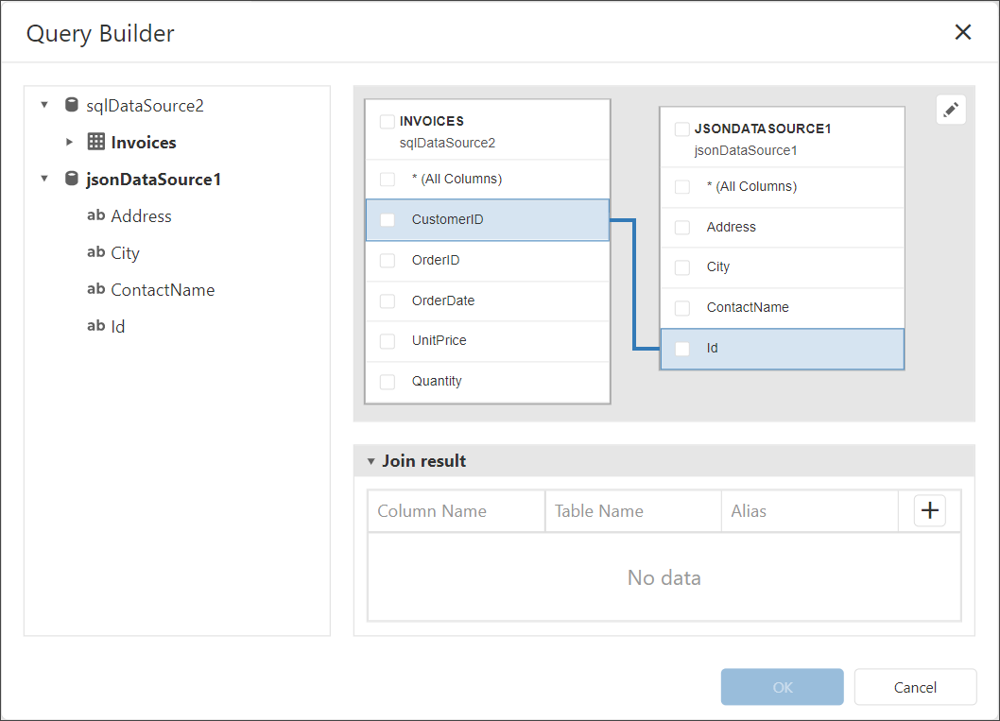
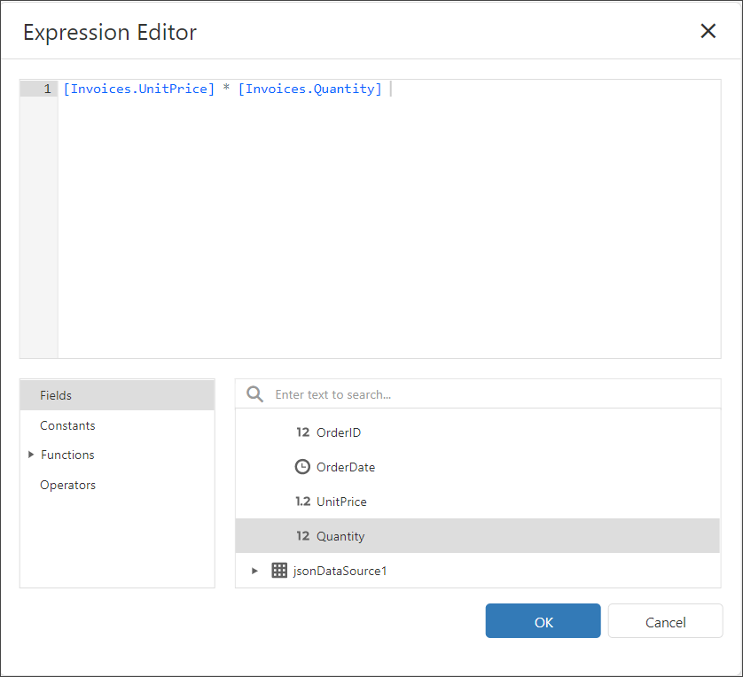

# Bind a Report to a Join-Based Federated Data Source

This topic describes how to create a federated data source that joins data from multiple data sources into a single query.

## Create a Report and Data Sources

1. [Create a new blank report](../../../articles/report-designer/report-designer-tools/report-wizard/empty-report.md).

2. [Add a SQL data source](../../../articles/report-designer/bind-to-data/bind-a-report-to-a-database.md) that retrieves data from the `Invoices` view of the **Northwind** database.

3. [Add a JSON data source](../../../articles/report-designer/bind-to-data/bind-a-report-to-json-data.md) that retrieves customer data from the [https://raw.githubusercontent.com/DevExpress-Examples/DataSources/master/JSON/customers.json](https://raw.githubusercontent.com/DevExpress-Examples/DataSources/master/JSON/customers.json) location.

    

## Create Data Federation

1. Invoke the designer [menu](../report-designer-tools/menu.md) and click **Add Data Source**.

    


1. Select **Data Federation** in the invoked [Data Source Wizard](../report-designer-tools/data-source-wizard.md) and click **Next**.

    

1. On the next page, click the **+ (plus) button** and select **Join** to add a Join query.

    

1. In the invoked [Query Builder](../../../articles/report-designer/report-designer-tools/query-builder.md), drag and drop the table from the SQL data source onto the design surface.

    

1. Drag and drop the JSON data source onto the design surface.

    

1. Click a field in one table and drag it to the related field in another table to create a Join relationship. 

    

1. Select the line that indicates a relationship and click the Edit button in the upper right corner of the design surface to invoke the Relation Properties editor.

    

   The editor allows you to change the join type and operator.

1. Select the data fields that you want to include in the result set.

    

    You can specify a different name for a field. Click the field's **Alias** cell and enter the field name.

1. Click the **+ (plus) button** to add a field to the query. Click the field's **f-button** to switch to the Expression edit mode.

    

1. Click the **ellipsis (...)** in the field to invoke the [Expression Editor](../use-expressions.md) and construct an expression for the field value:

    ```
    [Invoices.UnitPrice] * [Invoices.Quantity] 
    ```

    

    Click **OK** to close the Expression Editor. 

1. Specify _Amount_ as the alias for the newly created calculated field.

    

    Click **OK** to close the Query Builder. 
    
1. Click **Finish** to complete the Data Source Wizard.

    
 
    The Wizard creates a new **FederationDataSource** that includes a single query. 
    
## Manage the Federation Data Source

The federation data source is shown in the Field List.


When you create a federated query, its name is set to the name of the first table added to the query. You can rename the query in the **Manage Queries** dialog. To invoke the dialog, click the **Manage Queries** button.


The **Manage Queries** dialog appears.


Click the query name in the list to invoke the text editor and change the name.


The **Manage Queries** dialog allows you to add, modify, or delete queries.

To add a new query, click the **Add query** drop-down in the bottom left corner and select the query type: Join, Union, or Transform. The Query Builder is invoked to help you construct a new query.

To edit a query, select the query name in the list and click the **Edit button** that appears in the selected item. The Query Builder window is invoked to help you edit the query.

To delete a query, select the query name in the list and click the **Delete button** that appears in the selected item. The query is deleted without confirmation.

> [!NOTE]
> Once you rename the query, update the report's **Data Member** property.

