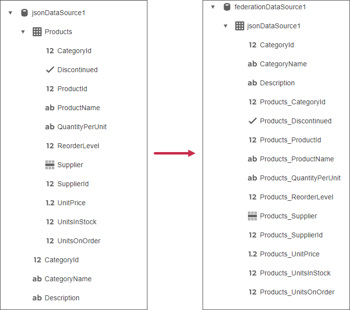
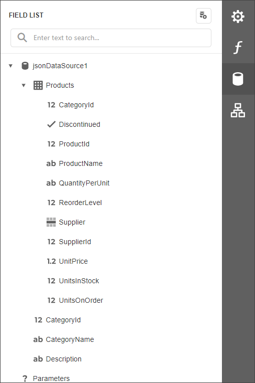
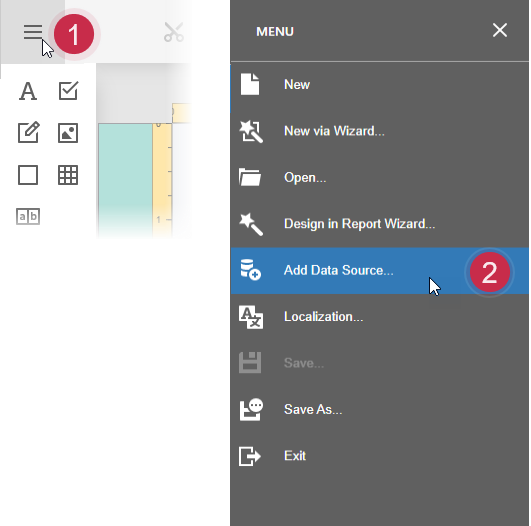
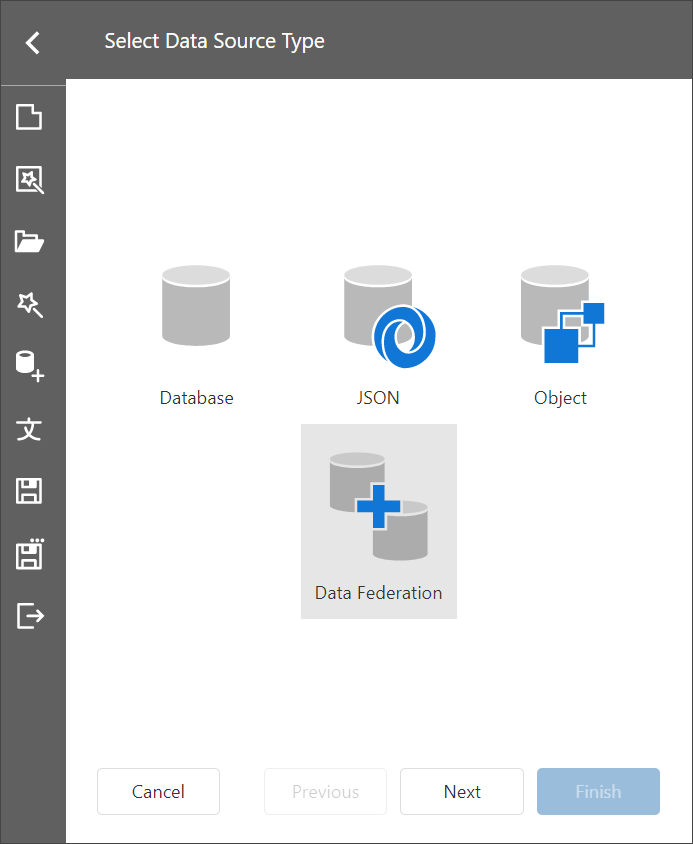
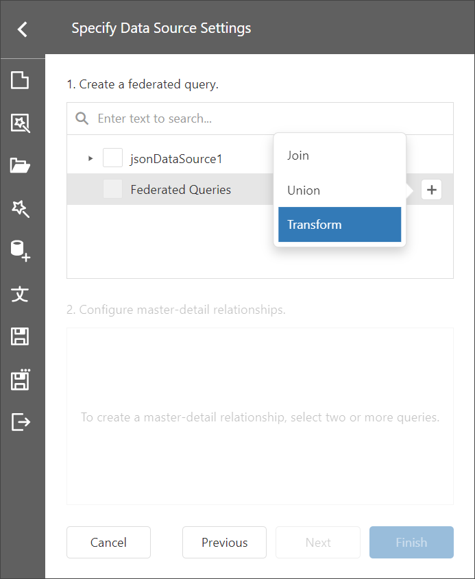
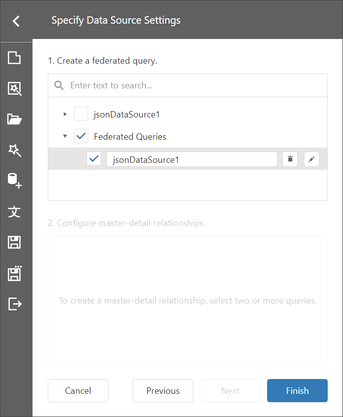
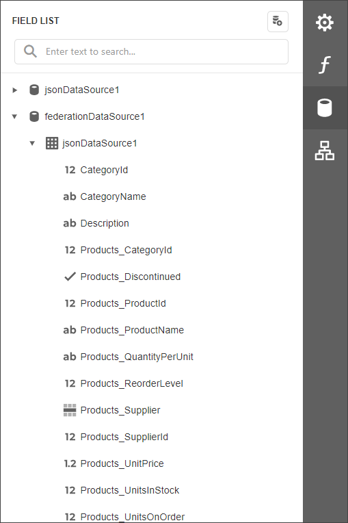

# Bind a Report to a Transformation-Based Data Source

If the data source contains hierarchical data, it can be transformed to flatten nested fields and display them as separate fields. If the data column is an array, you can unfold its values and display a new row of data for each element of the array.

The following image illustrates the transformation applied to a complex JSON data source.  



This help topic describes how to use the **Transformation** query of the **Federation Data Source** to flatten a JSON Data Source that contains nested data (collection property).

## Create a Report and Data Sources

1. [Create a new blank report](../../../articles/report-designer/report-designer-tools/report-wizard/empty-report.md).

1. [Add a JSON data source](../../../articles/report-designer/bind-to-data/bind-a-report-to-json-data.md) that uses the following JSON string:

    ```
    [
    {
        "CategoryId": 1,
        "CategoryName": "Beverages",
        "Description": "Soft drinks, coffees, teas, beers, and ales",
        "Products": [
        {
            "ProductId": 1,
            "ProductName": "Chai",
            "SupplierId": 1,
            "CategoryId": 1,
            "QuantityPerUnit": "10 boxes x 20 bags",
            "UnitPrice": 18.0000,
            "UnitsInStock": 39,
            "UnitsOnOrder": 0,
            "ReorderLevel": 10,
            "Discontinued": false,
            "Supplier": null
        },
        {
            "ProductId": 2,
            "ProductName": "Chang",
            "SupplierId": 1,
            "CategoryId": 1,
            "QuantityPerUnit": "24 - 12 oz bottles",
            "UnitPrice": 19.0000,
            "UnitsInStock": 17,
            "UnitsOnOrder": 40,
            "ReorderLevel": 25,
            "Discontinued": false,
            "Supplier": null
        }
        ]
    },
    {
        "CategoryId": 2,
        "CategoryName": "Condiments",
        "Description": "Sweet and savory sauces, relishes, spreads, and seasonings",
        "Products": [
        {
            "ProductId": 3,
            "ProductName": "Aniseed Syrup",
            "SupplierId": 1,
            "CategoryId": 2,
            "QuantityPerUnit": "12 - 550 ml bottles",
            "UnitPrice": 10.0000,
            "UnitsInStock": 13,
            "UnitsOnOrder": 70,
            "ReorderLevel": 25,
            "Discontinued": false,
            "Supplier": null
        },
        {
            "ProductId": 4,
            "ProductName": "Chef Anton's Cajun Seasoning",
            "SupplierId": 2,
            "CategoryId": 2,
            "QuantityPerUnit": "48 - 6 oz jars",
            "UnitPrice": 22.0000,
            "UnitsInStock": 53,
            "UnitsOnOrder": 0,
            "ReorderLevel": 0,
            "Discontinued": false,
            "Supplier": null
        }
        ]
    }
    ]
    ```
The created JSON data source is displayed in the Field List pane:



## Create Data Federation

1. Invoke the designer [menu](../report-designer-tools/menu.md) and click **Add Data Source**.

    


1. Select **Data Federation** in the invoked [Data Source Wizard](../report-designer-tools/data-source-wizard.md) and click **Next**.

    

1. On the next page, click the **+ (plus) button** and select **Transform** to add a Transformation query.

    

1. The invoked [Query Builder](../../../articles/report-designer/report-designer-tools/query-builder.md) displays the columns that you can transform.

    

1. Select the **Transform** check box next to the column you need to unfold and flatten. You can specify the aliases for the generated columns.

    

    Click **OK** to close the Query Builder window.
    
1. Click **Finish** to create the data source.

    

The **Field List** displays the created Federation Data Source.



