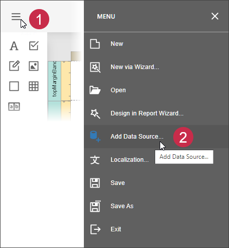
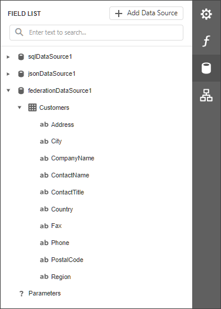

# Bind a Report to a Union-Based Federated Data Source

This topic describes how to create a union-based federated data source that combines two tables from different data sources by appending rows from one table to another.

## Create a Report and Data Sources

1. [Create a new blank report](../../../articles/report-designer/report-designer-tools/report-wizard/empty-report.md).

2. [Add a SQL data source](../../../articles/report-designer/bind-to-data/bind-a-report-to-a-database.md) that retrieves data from the `Customers` table of the **Northwind** database.

3. [Add a JSON data source](../../../articles/report-designer/bind-to-data/bind-a-report-to-json-data.md) that retrieves supplier data from the [https://services.odata.org/v4/northwind/northwind.svc/Suppliers](https://services.odata.org/v4/northwind/northwind.svc/Suppliers) location.

    

## Create Data Federation

1. Invoke the designer [menu](../report-designer-tools/menu.md) and click **Add Data Source**.

    

1. Select **Data Federation** in the invoked [Data Source Wizard](../report-designer-tools/data-source-wizard.md) and click **Next**.

    

1. On the next page, click the **+ (plus) button** and select **Union** to add a Union query.

    

1. In the invoked [Query Builder](../../../articles/report-designer/report-designer-tools/query-builder.md), drag and drop the table from the SQL data source onto the design surface.

    

1. Drag and drop the JSON data source onto the design surface.

    

1. The query includes only fields that have identical names and types in the original sources. You can specify a different name for a field. Click the field's **Alias** cell and enter the new field name, if necessary.

    You can select the **Union All** checkbox in the bottom left to prevent the removal of duplicate entries from the query result.

    Click **OK** to close the Query Builder window.

1. Click **Finish** to complete the Data Source Wizard.

    
 
    The Wizard creates a new **FederationDataSource** that includes similar data from both data sources.

    

    

    
## Manage the Federation Data Source

When you create a federated query, its name is set to the name of the first table added to the query. You can rename the query in the **Manage Queries** dialog. To invoke the dialog, click the **Manage Queries** button.

The **Manage Queries** dialog appears.

Click the query name in the list to invoke the text editor and change the name.

The **Manage Queries** dialog allows you to add, modify, or delete queries.

To add a new query, click the **Add query** drop-down in the bottom left corner and select the query type: Join, Union, or Transform. The Query Builder is invoked to help you construct a new query.

To edit a query, select the query name in the list and click the **Edit button** that appears in the selected item. The Query Builder window is invoked to help you edit a query.

To delete a query, select the query name in the list and click the **Delete button** that appears in the selected item. The query is deleted without confirmation.

> [!NOTE]
> Once you rename the query, update the report's **Data Member** property.

