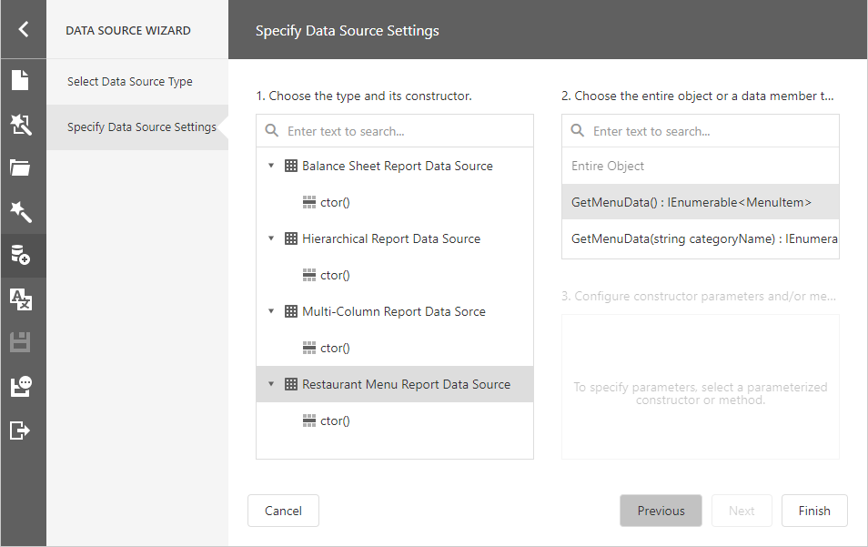
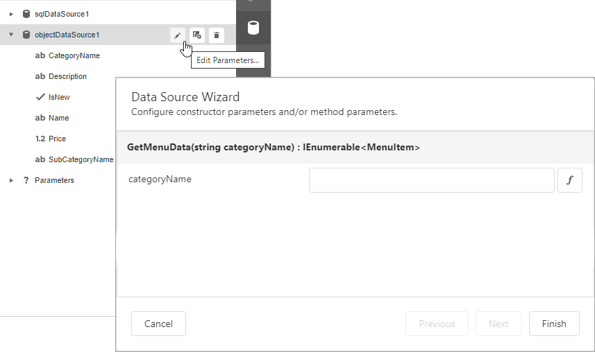

# Bind a Report to an Object Data Source

This topic describes how to bind a report to object data at design time.

## Add a New Data Source

1. Select **Add Data Source** from the [designer menu](../report-designer-tools/menu.md).
	
    

    This invokes the [Data Source Wizard](../report-designer-tools/data-source-wizard.md).

2. Choose **Object** and click **Next**.
	
    

3. Specify data source settings on the next screen.

    

    * Select an object type or constructor from the list. If you select an object type, the default constructor is invoked.

        

    * Select the method that should provide data. Alternatively, select **Entire Object** to bind the report to the object's fields.

        

    * Specify input values for the constructor and/or data member if required.

        

        You can use expressions to provide data source parameter values. Click the  button to switch the parameter's editor to the expression mode. Specify an expression in the parameter's editor, or click the parameter's ellipsis button to launch the [Expression Editor](../report-designer-tools/expression-editor.md). You can use [report parameters](../shape-report-data/use-report-parameters.md) in expressions to specify an input value for a data source parameter.

        

Click **Finish** to close the Data Source Wizard.

After you finish the wizard, it creates an **ObjectDataSource** component and binds the report to this component. The component retrieves the data fields that the selected object or method exposes. The [Field List](../report-designer-tools/ui-panels/field-list.md) reflects the data source structure.

## Configure Parameters

Choose an **ObjectDataSource** component in the Field List and click **Edit Parameters**. Reconfigure the parameters on the invoked wizard page and click **Finish** to apply the changes.

For more information on how to set up an object data source, refer to the [Data Source Wizard](../report-designer-tools/data-source-wizard.md).