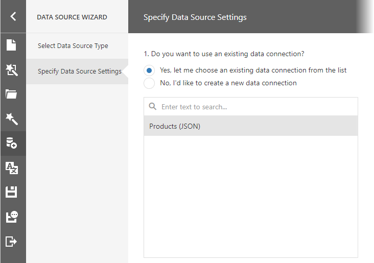

# Bind a Report to JSON Data

This topic describes how to bind a report to JSON data at design time.

## Create a Project and Prepare a Data Source

1. [Create a new blank report](../../report-designer/add-new-reports.md).

2. Invoke the designer [menu](../report-designer-tools/menu.md) and click **Add Data Source...**.
	
    

    This invokes the Data Source Wizard.

3. Choose the **JSON** option and click **Next**.
	
    

4. The next wizard page allows you to specify whether you want to use an existing data connection or create a new data connection.

    

    

    If you prefer to create a new data connection, specify its settings. 

    

    Specify request parameters.

    

    Specify the Basic HTTP Authentication parameters or header parameters to access JSON data.

5. Also, on this page, the wizard shows the specified JSON data's structure. You can choose all nodes or a subset of nodes.

    

    Uncheck the data fields that your report does not require.

    After you finish the wizard, it creates the **JsonDataSource** component. This component retrieves the checked data fields that the selected JSON element includes. The [Field List](../report-designer-tools/ui-panels/field-list.md) reflects the data source structure.
 
    

## Customize the JSON Data Source Schema

Choose the **JsonDataSource** component in the Field List and click **Edit Schema...**. Reconfigure data fields in the invoked wizard page.

